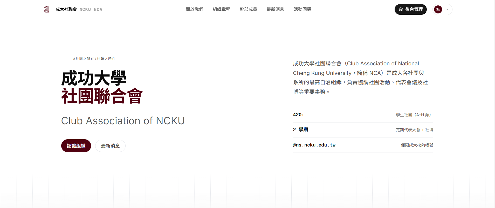
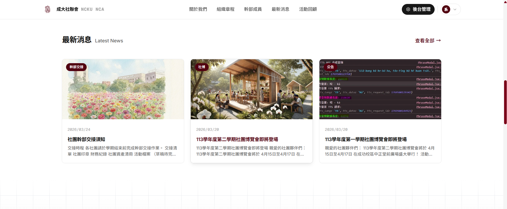
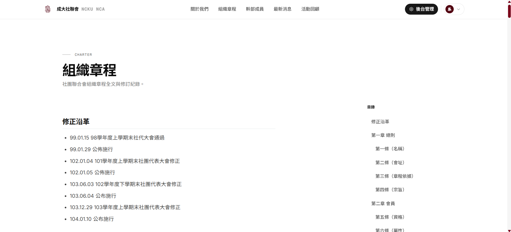
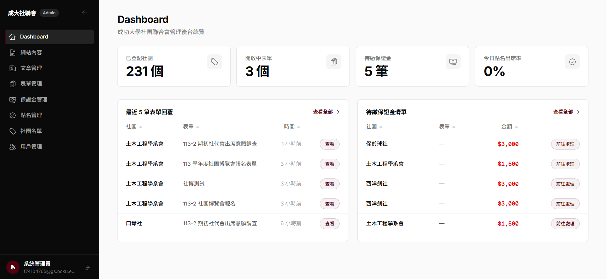

# NCKU-NCA 專案操作手冊

## 1. 專案概觀

此專案為成大社聯會數位平台，主要提供：

- 公開頁面：公告、表單填寫、點名頁面
- 管理後台：表單管理、點名管理、保證金管理、內容管理
- 資料來源整合：由學校社團平台抓取社團資料，統一匯入 YAML/Firestore

核心技術：

- Frontend / Backend：Next.js (App Router)
- Database：Firebase Firestore
- Auth：Firebase Session
- 腳本：TypeScript (tsx) + Python

### 1.1 介面介紹

| 介面 | 圖片 |
| --- | --- |
| 1. 首頁 |  |
| 2. 最新消息 |  |
| 3. 文章區塊 |  |
| 4. 後臺 Dashboard |  |

## 2. 目錄與角色

主要路徑：

- `web/`：網站主程式（含後台、API）
- `scripts/`：資料同步與種子腳本
- `data/`：靜態資料與 YAML 資料檔

權限角色：

- 一般使用者：可登入、填表、簽到
- 管理員：admin（需在 `users/{uid}.role = "admin"`）

## 3. 本機環境準備

### 3.1 必要安裝

- Node.js 20+
- npm
- Python 3.10+
- （若要跑抓資料腳本）Playwright Chromium

### 3.2 安裝網站依賴

在專案根目錄執行：

```bash
cd web
npm install
```

### 3.3 啟動開發伺服器

```bash
cd web
npm run dev
```

預設網址：`http://localhost:3000`

### 3.4 Firebase 設定（Client + Admin）

本專案同時使用 Firebase Client SDK（前端登入）與 Admin SDK（後端 API / seed）。

建議先複製環境檔：

```bash
cd web
copy .env.example .env
```

#### Step 1：建立 Firebase 專案

1. 進入 Firebase Console，建立新專案（或使用既有專案）。
2. 啟用 Firestore Database（建議先用測試模式，之後再收斂規則）。

#### Step 2：啟用 Authentication（Google）

1. 到 Authentication -> Sign-in method。
2. 啟用 `Google` 登入。
3. 在 Authorized domains 加入開發與正式網域（例如 `localhost`）。

說明：

- 本專案登入流程使用 Google Provider。
- 前端程式會限制僅允許 `@gs.ncku.edu.tw` 信箱登入。

#### Step 3：建立 Web App 並填入 Client SDK 參數

1. 在 Firebase 專案設定新增 Web App。
2. 取得 SDK 設定值，填入 `web/.env`：

- `NEXT_PUBLIC_FIREBASE_API_KEY`
- `NEXT_PUBLIC_FIREBASE_AUTH_DOMAIN`
- `NEXT_PUBLIC_FIREBASE_PROJECT_ID`
- `NEXT_PUBLIC_FIREBASE_STORAGE_BUCKET`
- `NEXT_PUBLIC_FIREBASE_MESSAGING_SENDER_ID`
- `NEXT_PUBLIC_FIREBASE_APP_ID`

#### Step 4：建立 Service Account 並設定 Admin SDK

1. 到 Firebase Console -> Project settings -> Service accounts。
2. 點擊 `Generate new private key`，下載 JSON 金鑰。
3. 將 JSON 內容 base64 編碼後，填入：

- `FIREBASE_ADMIN_SERVICE_ACCOUNT_BASE64`

PowerShell 範例（Windows）：

```powershell
$bytes = [System.IO.File]::ReadAllBytes("service-account.json")
[Convert]::ToBase64String($bytes)
```

若有使用 Firebase Storage Admin 操作，可額外設定：

- `FIREBASE_STORAGE_BUCKET`（未設定時，系統會 fallback 到 `NEXT_PUBLIC_FIREBASE_STORAGE_BUCKET`）

#### Step 5：驗證 Firebase 設定

1. 啟動網站：`cd web && npm run dev`。
2. 到登入頁測試 Google 登入。
3. 執行 seed：`cd web && npm run seed`。
4. 確認 Firestore 有成功寫入 `clubs` 與 `site_content`。

### 3.5 Cloudflare R2 圖片上傳環境變數

若要啟用後台圖片上傳（公告內容內文圖片、封面圖），請在 `web/.env` 設定：

- `CLOUDFLARE_R2_ACCOUNT_ID`
- `CLOUDFLARE_R2_ACCESS_KEY_ID`
- `CLOUDFLARE_R2_SECRET_ACCESS_KEY`
- `CLOUDFLARE_R2_BUCKET`
- `CLOUDFLARE_R2_PUBLIC_BASE_URL`（例如 `https://<public-host>`）

說明：

- 系統會直接回傳公開 URL，不使用簽名 URL。
- 請先確保 R2 Bucket 已設定公開讀取（Public Access）。

### 3.6 Cloudflare R2 詳細設定教學（含參數取得方式）

本節會一步一步說明如何取得每一個 R2 參數。

前置條件：

- 你有 Cloudflare 帳號，且已啟用 R2。
- 你有該 Cloudflare 帳號的 R2 操作權限。

#### Step 1：進入 R2 Overview 頁面

1. 登入 Cloudflare Dashboard。
2. 左側選單選擇 `R2 Object Storage -> Overview`。

#### Step 2：建立 Bucket 與取得 Account ID

1. 在 Overview 頁面點擊 `Create bucket`。
2. 輸入 bucket 名稱（例如：`ncku-nca-images`）。
3. 在右側 `Account Details` 區塊取得 `Account ID`。

你會得到：

- `CLOUDFLARE_R2_BUCKET`：就是你建立的 bucket 名稱。
- `CLOUDFLARE_R2_ACCOUNT_ID`：Cloudflare 帳號的 Account ID。

#### Step 3：找到 Manage R2 API Tokens

1. 在 R2 `Overview` 頁面的右側 `Account Details` 區塊。
2. 點擊 `Manage R2 API Tokens`。

#### Step 4：建立 R2 API Token

1. 點擊 `Create API token`。
2. 依需求填寫欄位：
   - `Token Name`：例如 `ncku-nca-r2-token`。
   - `Permissions`：一般上傳場景建議選 `Object Read & Write`。
   - `Specify Bucket(s)`：建議只授權目標 bucket（最小權限原則）。
   - `TTL`：可選 `Forever`，或設定到期時間。
3. 點擊 `Create API Token`。

建立後會顯示：

- `Access Key ID`
- `Secret Access Key`（通常只顯示一次，請立即保存）

說明：

- 本專案使用的是 R2 API Token 建立出的 S3 相容金鑰，不是 Cloudflare Global API Key。

建議權限：

- 最小權限原則，至少允許目標 bucket 的 `Object Read` 與 `Object Write`。

#### Step 5：保存 Access Key / Secret Key

請立刻把 Access Key / Secret Key 保存到密碼管理工具或安全位置。

填入：

- `CLOUDFLARE_R2_ACCESS_KEY_ID`：對應 Access Key ID。
- `CLOUDFLARE_R2_SECRET_ACCESS_KEY`：對應 Secret Access Key。

#### Step 6：設定公開讀取網址（Public Base URL）

目前系統是「上傳後直接回傳公開 URL」，所以需要可公開讀取的 base URL。

常見做法：

1. 直接使用 R2 的公開網域（若你已啟用 Public bucket）。
2. 使用自訂網域（Custom Domain）指向 R2 bucket（建議正式環境）。

設定要求：

- `CLOUDFLARE_R2_PUBLIC_BASE_URL` 必須是「不含尾端斜線」的基底網址。
- 範例：
  - `https://pub-xxxxxxxx.r2.dev`
  - `https://cdn.your-domain.com`

#### Step 7：寫入環境變數

將以下內容填入 `web/.env`：

```bash
CLOUDFLARE_R2_ACCOUNT_ID=你的AccountID
CLOUDFLARE_R2_ACCESS_KEY_ID=你的AccessKeyID
CLOUDFLARE_R2_SECRET_ACCESS_KEY=你的SecretAccessKey
CLOUDFLARE_R2_BUCKET=你的Bucket名稱
CLOUDFLARE_R2_PUBLIC_BASE_URL=https://你的公開網域
```

另外在 `web/.env.example` 也保留同樣欄位（不放真值），避免團隊成員遺漏設定。

#### Step 8：驗證設定是否成功

1. 啟動網站：`cd web && npm run dev`。
2. 以管理員登入後台。
3. 到文章管理頁或 Markdown 編輯器上傳圖片。
4. 成功後檢查：
   - 回傳連結是否為你設定的 `CLOUDFLARE_R2_PUBLIC_BASE_URL` 網域。
   - 瀏覽器可直接開啟該圖片 URL。

若上傳失敗，優先檢查：

- Access Key / Secret 是否貼錯。
- Token 權限是否包含目標 bucket 的寫入權限。
- Bucket 名稱是否一致。
- Public Base URL 是否可公開存取。

## 4. 後台操作總覽

後台主要入口（登入且具 admin 權限）：

- `/admin/forms`：表單管理
- `/admin/attendance`：點名管理
- `/admin/deposit`：保證金管理

建議作業順序（典型活動）：

1. 建立表單（必要時含保證金策略）
2. 活動當日建立點名活動並發送點名密碼
3. 活動後依表單回覆與活動規則處理保證金狀態

---

## 5. 教學 A：如何建構表單（後台）

### 5.1 進入表單管理

1. 登入管理員帳號。
2. 進入 `/admin/forms`。
3. 可看到現有表單清單與狀態：`草稿`、`開放中`、`已關閉`。

### 5.2 建立新表單（兩種方式）

點擊「新增」後，會先出現模板選擇器：

- 套用模板：快速帶入常用欄位與設定（如社博、寒假場協、一般報名）
- 空白表單：完全自行設計欄位

### 5.3 設定表單基本資料（Basic）

建立或編輯時，至少確認：

- `title`：表單名稱（必填）
- `description`：對外說明
- `form_type`：表單類型
- `status`：
  - `draft`：草稿，不對外使用
  - `open`：開放填寫
  - `closed`：停止填寫
- `closes_at`：截止時間（建議設定）

### 5.4 設定保證金政策（Deposit Policy）

可在表單中設定：

- `required`：是否需保證金
- `amount`：保證金金額
- `binding_mode`：
  - `linked_to_response`：綁定表單回覆
  - `independent`：獨立流程管理

建議：

- 活動報名類型（社博、場協）設 `required = true`
- 問卷類型設 `required = false`

### 5.5 設定欄位（Fields）

可配置欄位型別包含：

- text / textarea / number
- email / phone / date
- select / radio / checkbox
- file
- club_picker
- section_header（段落標題）

重點設定：

- `required`：是否必填
- `options`：選項型欄位內容
- `validation`：最小值、最大值、regex 等
- `depends_on`：條件顯示（進階）

### 5.6 表單送出規則（系統行為）

系統提交時會做以下檢查：

- 使用者必須登入
- 表單存在且未截止
- 必填欄位檢查
- 欄位格式檢查（email、phone、number、選項合法性）
- 同一社團同一表單不可重複送出（重複會回傳錯誤）

### 5.7 表單上線與驗收清單

建議上線前逐項確認：

1. 狀態已切到 `open`
2. 截止時間正確
3. 必填欄位與提示文字完整
4. 若需保證金，金額與規則已寫清楚
5. 用測試帳號實際送出一次

### 5.8 回覆管理與匯出

進入 `/admin/forms/{form_id}` 可：

- 查看表單預覽
- 檢視回覆列表
- 開啟單筆回覆詳情
- 匯出 CSV

---

## 6. 教學 B：點名流程（建立、簽到、補點）

### 6.1 點名流程概念

點名分為兩端：

- 管理端：建立點名活動、查看即時簽到、補點、匯出
- 使用端：社團登入後到 `/attendance` 送出簽到

### 6.2 建立點名活動（後台）

1. 進入 `/admin/attendance`
2. 點擊新增活動
3. 填寫：
   - `title`：活動名稱
   - `description`：活動說明
   - `opens_at`：開始時間
   - `closes_at`：結束時間（未填時系統預設 +2 小時）
   - `expected_categories`：預期點名社團類別（A-H）
   - `passcode`：點名密碼（必填）
4. 儲存後，活動會出現在列表，狀態會依時間顯示為即將開始/進行中/已結束。

### 6.3 現場簽到（社團端）

社團操作 `/attendance`：

1. 使用者先登入
2. 選擇社團
3. 輸入管理端提供之點名密碼
4. 送出簽到

系統檢查：

- 活動在開放時間內
- 密碼正確
- 社團在本次點名名單內
- 同一社團不可重複簽到

### 6.4 管理端查看簽到狀態

在 `/admin/attendance` 可：

- 看到每場活動已簽到數 / 應簽到數
- 開啟詳情檢視各社團簽到狀態
- 匯出 CSV（含簽到時間與狀態）

### 6.5 手動補點名（例外處理）

若社團現場有技術問題，管理端可在活動詳情對未簽到社團執行「手動補點名」。

建議補點流程：

1. 先確認社團身分與到場事實
2. 由管理員補點
3. 於備註或內部紀錄標示補點原因（例如網路問題）

---

## 7. 教學 C：保證金處理流程

### 7.1 資料來源與狀態

保證金管理頁為 `/admin/deposit`，每筆紀錄主要狀態：

- `pending_payment`：待繳
- `paid`：已繳
- `returned`：已退還

### 7.2 日常操作

管理員可進行：

- 搜尋社團（名稱 / ID）
- 依狀態篩選
- 單筆操作：
  - 待繳 -> 標記已繳
  - 已繳 -> 退還保證金
- 批次操作：
  - 多筆待繳 -> 批次標記已繳
  - 多筆已繳 -> 批次標記已退還
- 編輯備註（例如匯款末五碼、退費日期、人工核對註記）
- 匯出 CSV

### 7.3 建議標準作業（SOP）

建議每場活動依下列節奏執行：

1. 活動報名期間：追蹤 `pending_payment`
2. 截止日前：逐筆核帳並轉 `paid`
3. 活動結束後：依規則審核是否退還，更新為 `returned`
4. 每次狀態更新都補上備註，保留可稽核軌跡

### 7.4 稽核建議

- 每週匯出一次 CSV 與金流對帳
- 重要活動（社博）建議雙人覆核
- 若發生例外退費，需在備註記錄原因與時間

---

## 8. 腳本教學：從學校系統抓資料並匯入 YAML / Firestore

本章是你提出的重點流程：

- 從學校平台抓取最新社團資料
- 產生 `data/ncku-clubs.yaml`
- 匯入 Firestore `clubs` 集合

### 8.1 Python 腳本用途

使用腳本：`scripts/scrape_ncku_clubs.py`

功能：

- 從學校系統 `club0408` 抓取 A-H 分類社團
- 可手動登入後帶 cookie 抓取
- 逐筆呼叫明細 API（檢視）
- 輸出標準化 YAML

### 8.2 安裝 Python 依賴

在專案根目錄執行：

```bash
pip install requests beautifulsoup4 pyyaml playwright
playwright install chromium
```

### 8.3 執行抓取（建議標準流程）

```bash
python scripts/scrape_ncku_clubs.py
```

執行後流程：

1. 腳本會開啟瀏覽器
2. 你在瀏覽器手動登入學校系統
3. 回到終端機按 Enter
4. 腳本開始抓取各分類資料
5. 輸出 YAML 到預設路徑：`data/ncku-clubs.yaml`

### 8.4 常用參數

```bash
# 指定輸出路徑
python scripts/scrape_ncku_clubs.py --output data/ncku-clubs.yaml

# 若 session 已可直接存取，可跳過手動登入
python scripts/scrape_ncku_clubs.py --skip-login

# 額外包含 I 類（所學會）
python scripts/scrape_ncku_clubs.py --include-institute

# 調整逾時秒數
python scripts/scrape_ncku_clubs.py --timeout 60
```

### 8.5 驗證 YAML 內容

至少檢查：

- `meta.total_clubs` 是否合理
- `meta.scraped_at` 是否為本次時間
- `clubs[].id`、`category_code`、`status` 是否存在

### 8.6 匯入 Firestore（clubs + site_content）

本專案已有種子腳本：`scripts/seed-firestore.ts`

執行方式（推薦）：

```bash
cd web
npm run seed
```

或：

```bash
cd web
npx tsx ../scripts/seed-firestore.ts
```

此腳本會：

- 讀取 `data/formatted/*.md` 寫入 `site_content`
- 讀取 `data/ncku-clubs.yaml` 寫入 `clubs`
- 依社團狀態自動設定 `is_active`（`status == 正式`）

### 8.7 建議資料更新節奏

建議每學期或大型活動前執行一次：

1. 執行抓取腳本更新 YAML
2. 檢查 YAML 資料品質
3. 執行 seed 匯入 Firestore
4. 後台 spot check 幾個社團資料是否正確

---

## 9. 典型維運流程範例

以下為活動前到活動後的完整循環：

1. 更新社團主檔
   - 跑 `scrape_ncku_clubs.py`
   - 跑 `npm run seed`
2. 建立活動報名表
   - 選模板
   - 設定截止與保證金
   - 狀態改為 `open`
3. 活動當天點名
   - 建立點名活動與密碼
   - 監看簽到情況
   - 例外情形補點
4. 活動後保證金作業
   - 對帳後更新狀態
   - 註記退費資訊
   - 匯出 CSV 存檔

---

## 10. 常見問題排除

### Q1. 後台 API 都回未授權

檢查：

- 是否已登入
- `users/{uid}.role` 是否為 `admin`
- Session 是否過期（重新登入）

### Q2. 表單無法送出

檢查：

- 表單狀態是否為 `open`
- 是否已過 `closes_at`
- 必填欄位與格式是否符合
- 是否同社團重複送出

### Q3. 點名顯示密碼錯誤或未開放

檢查：

- passcode 是否含多餘空白
- 活動時間是否已開始且未截止
- 社團是否屬於本次點名範圍

### Q4. 種子腳本執行失敗

檢查：

- `web/.env` 是否有 `FIREBASE_ADMIN_SERVICE_ACCOUNT_BASE64`
- base64 JSON 是否有效
- `data/ncku-clubs.yaml` 檔案是否存在且可解析

---

## 11. 開發者常用指令

```bash
# 啟動開發
cd web
npm run dev

# 型式檢查
npm run lint

# 建置檢查
npm run build

# 匯入資料（clubs + site_content）
npm run seed

# 抓取學校社團資料（在專案根目錄）
python scripts/scrape_ncku_clubs.py
```

---

## 12. 文件維護建議

若後台流程有調整，請同步更新本文件以下章節：

- 第 5 章（表單）
- 第 6 章（點名）
- 第 7 章（保證金）
- 第 8 章（資料抓取與匯入）

維持「系統實作」與「操作文件」一致，能大幅降低交接成本。
